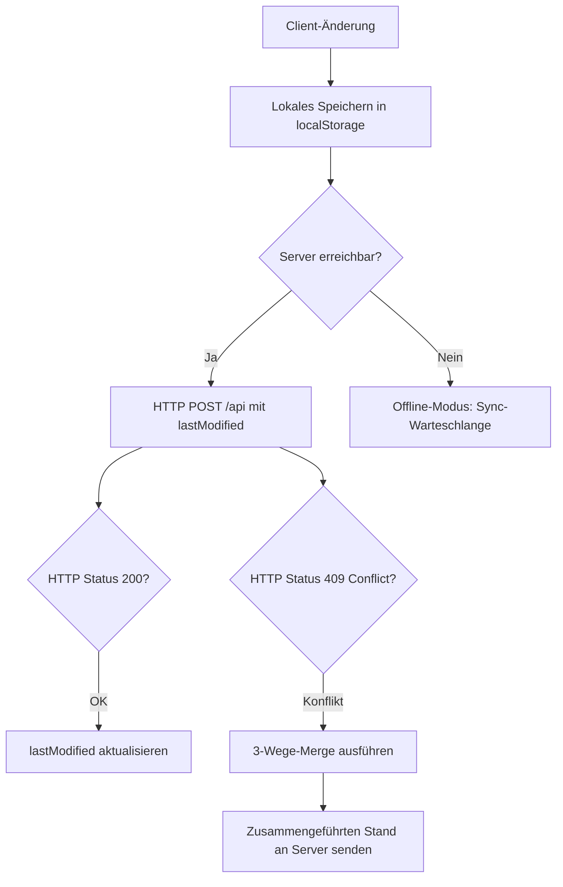

# RadPlan — Digitaler Dienstplan für die Klinik für Radiologie & Nuklearmedizin

> **RadPlan** ist eine vollständig im Browser laufende, hochspezialisierte Dienstplan­anwendung für die **Klinik für Radiologie & Nuklearmedizin am Klinikum St. Georg Leipzig**. Sie verbindet ein dichtes, tabellarisches Monatsraster mit einem regelbasierten, mehrzyklischen Optimierungs­algorithmus (dem *RadPlan Neural Scheduler*), tiefen Mitarbeiter- und Jahresauswertungen, einem isolierten Planungsmodus und einer servergestützten Echtzeit-Synchronisation — verpackt in eine sorgfältig ausgearbeitete, barrierearme und touch-taugliche Oberfläche mit Hell-/Dunkelmodus.
> 
> Diese Dokumentation beschreibt den **vollständigen aktuellen Funktions- und Code-Stand** der Anwendung bis ins Detail: jede Ansicht, jedes Bedienelement, jede Regel, jeden Datenpfad, jede CSS-Datei, jede JS-Klasse und jede Tastenkombination.

---

## Inhaltsverzeichnis

1. [Was RadPlan löst — die Domäne](#1-was-radplan-l%C3%B6st--die-dom%C3%A4ne)
2. [Technologie-Stack & Architektur](#2-technologie-stack--architektur)
3. [Fachliches Datenmodell & Datenfluss](#3-fachliches-datenmodell--datenfluss)
4. [Stammdaten, Rollen & Sonderregeln](#4-stammdaten-rollen--sonderregeln)
5. [Persistenz & Server-Synchronisation](#5-persistenz--server-synchronisation)
6. [Gesamtaufbau der Oberfläche](#6-gesamtaufbau-der-oberfl%C3%A4che)
7. [Das Dienstplan-Raster im Detail](#7-das-dienstplan-raster-im-detail)
8. [Zell-Interaktion: Editor, Schnellaktionen, Gestik & Tastatur](#8-zell-interaktion-editor-schnellaktionen-gestik--tastatur)
9. [Der Planungsmodus (Entwurfs-Sandbox)](#9-der-planungsmodus-entwurfs-sandbox)
10. [Der RadPlan Neural Scheduler (Auto-Plan)](#10-der-radplan-neural-scheduler-auto-plan)
11. [Mitarbeitendenbereich (Team- & Person-Modal)](#11-mitarbeitendenbereich-team--person-modal)
12. [Der Auswertungs-Hub (Auswertungen)](#12-der-auswertungs-hub-auswertungen)
13. [Abteilungsübersicht](#13-abteilungs%C3%BCbersicht)
14. [Befehlspalette](#14-befehlspalette)
15. [Drucken & PDF-Export](#15-drucken--pdf-export)
16. [Import & Export von Daten](#16-import--export-von-daten)
17. [Darstellung, Theming & Barrierefreiheit](#17-darstellung-theming--barrierefreiheit)
18. [Mobile- & Responsive-Erfahrung](#18-mobile--responsive-erfahrung)
19. [Kalender- & Feiertagslogik](#19-kalender--feiertagslogik)
20. [Vollständige Tastaturkürzel-Referenz](#20-vollst%C3%A4ndige-tastaturk%C3%BCrzel-referenz)
21. [Vollständige Projektstruktur & Dateibeschreibungen](#21-vollst%C3%A4ndige-projektstruktur--dateibeschreibungen)
22. [Entwicklung, Tests & Deployment](#22-entwicklung-tests--deployment)
23. [Glossar & Codetabellen](#23-glossar--codetabellen)

---

## 1. Was RadPlan löst — die Domäne

In einer klinischen radiologischen Abteilung müssen an jedem Tag des Jahres zwei kritische Dienste lückenlos und qualifiziert besetzt sein:

1. **Bereitschaftsdienst (BD / Code „D")** — Der Arzt vor Ort, der die Akutversorgung trägt, Notfall-CTs und -MRTs befundet, Kontrastmittelüberwachungen durchführt und klinische Anfragen steuert.
2. **Hintergrunddienst (HG)** — Die fachärztliche Rückfallebene im Hintergrund (Rufbereitschaft), die telefonisch beratend zur Seite steht, komplexe Befunde freigibt, Interventionsentscheidungen trifft und bei personellen Engpässen oder Katastrophenfällen einspringt.

Daneben werden die Ärztinnen und Ärzte der Abteilung an Werktagen auf verschiedene **Arbeitsplätze** (Modalitäten) verteilt. Hierzu zählen Großgeräte (Magnetresonanztomographie - MRT, Computertomographie - CT, Sonographie - US, Angiographie - AN), Spezialbereiche (Mammographie - MA, Kinder-Ultraschall - KUS), Außenstandorte (Wermsdorf - W) und die Teleradiologie (T).

Die Dienstplanung steht vor der Herausforderung, diese Dienste und Modalitäten unter Beachtung strenger Restriktionen zu verteilen:
*   **Gesetzliche Vorgaben:** Einhaltung von Ruhezeiten (nach einem Bereitschaftsdienst am Folgetag zwingend dienstfrei).
*   **Fachliche Qualifikation:** Wochenend-Bereitschaftsdienste und alle Hintergrunddienste dürfen ausschließlich von vollapprobierten Fachärztinnen und Fachärzten geleistet werden.
*   **Soziale Kriterien & Fairness:** Gleichmäßige Verteilung der Dienste über das Jahr, Berücksichtigung von Wünschen und Urlauben, Vermeidung von aufeinanderfolgenden Dienstwochenenden sowie Einhaltung individueller vertraglicher Sondervereinbarungen (Dienstreduktion, Befreiungen).

RadPlan digitalisiert diesen Prozess. Es ermöglicht sowohl die präzise **manuelle Erfassung** als auch die **vollautomatische Berechnung** eines optimierten Dienstplans über einen regelbasierten, mehrzyklischen Scheduling-Algorithmus.

---

## 2. Technologie-Stack & Architektur

RadPlan ist konsequent als **Single-Page-Application (SPA) ohne Build-Schritt** konzipiert. Dies minimiert die Komplexität und ermöglicht das direkte Ausführen der Anwendung im Browser ohne Transpiler, Compiler oder lokale Paketinstallationen.

### 2.1 Frontend-Laufzeit & Sprachen
*   **HTML5:** Bildet das statische Anwendungsgerüst in der Datei `index.html`. Diese enthält alle Skelette der Modal-Dialoge, Anzeigebereiche und Steuerungselemente.
*   **ECMAScript-Module (ESM):** Moderner, nativer JavaScript-Code (`<script type="module">`). Module importieren und exportieren Klassen, Konstanten und Funktionen direkt im Browser.
*   **CSS3:** Das Styling ist konsequent modular in zahlreiche themen- und modulbezogene CSS-Dateien unterteilt (Kern, Layout, Komponenten, Modals, Ansichten sowie je ein Stylesheet pro Auswertungs-Modul; siehe [Projektstruktur](#21-vollst%C3%A4ndige-projektstruktur--dateibeschreibungen)). Es nutzt CSS-Variablen (Custom Properties) für dynamisches Farbschema-Theming (Hell-/Dunkelmodus), flexible Flexbox- und Grid-Layouts sowie Animationen.

### 2.2 Externe Bibliotheken (per CDN eingebunden)
Wenn die CDN-Bibliotheken nicht erreichbar sind, bleibt die Anwendung dank *Graceful Degradation* im Kern voll einsatzfähig:
*   **Chart.js (v4.4.4):** Rendert alle Diagramme (Arbeitsplatzverteilungen, Trendkurven im Profil, Fairness-Liniendiagramme im Jahresplan, Projektionsgrafiken).
*   **GSAP (GreenSock Animation Platform v3.12.2):** Sorgt für weiche Animationsübergänge (u. a. Einblendungen und Status-Transitions).
*   **jsPDF (v2.5.1) & jspdf-autotable (v3.8.2):** Ermöglichen die direkte Generierung von mehrseitigen PDF-Dokumenten im A4-Format auf Clientseite.
*   **IBM Plex Sans & IBM Plex Mono:** Webfonts für optimale Lesbarkeit. Die Festbreitenschrift (Mono) wird gezielt für numerische Daten und Dienst-Codes genutzt, um das visuelle Springen bei Zahlenänderungen zu verhindern.

### 2.3 Edge-Backend & Persistenz
*   **Cloudflare Pages Functions:** Eine serverlose Javascript-Funktion in `functions/api.js` bildet die Server-Schnittstelle. Sie wird über die Route `/api` angesprochen.
*   **Cloudflare KV (Key-Value-Namespace):** Der persistente Datenspeicher auf Cloudflare-Edge-Servern. Das Binding erfolgt über `RADPLAN_KV` unter dem Schlüssel `RADPLAN_DATA`.
*   **Nebenläufigkeitsschutz:** Verhindert das gegenseitige Überschreiben bei gleichzeitigen Planungszugriffen durch einen präzisen `lastModified`-Zeitstempel und einen Client-seitigen 3-Wege-Merge-Algorithmus.

---

## 3. Fachliches Datenmodell & Datenfluss

### 3.1 Globale Datenstruktur `DATA`
Der gesamte Zustand aller Pläne ist in einem einzigen, hierarchischen JSON-Objekt namens `DATA` abgelegt. Seine Hauptschlüssel sind die Monate im Format `YYYY-M` (wobei der Monat 0-basiert ist, z. B. `"2026-5"` für Juni 2026).

```jsonc
{
  "2026-5": {
    "employees": [
      "Prof. Schäfer",
      "Dr. Lurz",
      "Dr. Becker",
      "Dr. Martin"
    ],
    "assignments": {
      "Dr. Martin": {
        "3": { "assignment": "CT", "duty": "HG" },   // Tag 3: Arbeitsplatz CT, Hintergrunddienst
        "12": { "assignment": "MR/US", "duty": "D" }, // Tag 12: Split-Arbeitsplatz, Bereitschaftsdienst
        "13": { "assignment": "F" }                   // Tag 13: Dienstfrei
      }
    },
    "rbn": {
      "3": "Dr. Maybaum (NRAD)",
      "12": "Dr. Bailis (NRAD)"
    },
    "comments": {
      "Dr. Martin": {
        "12": "Vertretung für MRT"
      }
    }
  }
}
```

### 3.2 Zellspezifische Datenbereinigung
Um Speicherplatz zu sparen und JSON-Strukturvergleiche sauber zu halten, werden Zellen bei Änderungen bereinigt (`cleanupAssignmentCell`):
*   Enthält eine Zelle weder eine Zuweisung (`assignment`), einen Dienst (`duty`), Wünsche, Pins noch Kommentare, wird das entsprechende Tagesobjekt vollständig gelöscht.
*   Hat ein Mitarbeiter an einem bestimmten Tag gar keine Einträge mehr, wird sein Tageseintrag aus `assignments` entfernt.

### 3.3 RBN-Zeile (Rufdienst Neuroradiologie)
Zusätzlich zur personenbezogenen Matrix existiert eine globale Planungszeile **„RD Neurorad"** (Rufdienst der Neuroradiologie), welche in `md.rbn[day]` gespeichert wird:
*   Sie ist ab Juni 2025 (`RBN_ROW_START`) sichtbar.
*   Sie greift auf einen speziellen Pool von Neuroradiologen und Radiologen zu (`RBN_OPTIONS`).
*   **Dynamische Gültigkeit:** *Fr. Thaler* steht nur bis einschließlich März 2026 (`RBN_THALER_LAST_MONTH`) zur Auswahl und wird danach automatisch aus der Dropdown-Liste ausgeblendet.

### 3.4 Personalabgänge (`EMPLOYEE_DEPARTURES`)
Um historische Pläne unverändert zu lassen, aber zukünftige Pläne von ausgeschiedenen Personen freizuhalten, wird befristetes Personal modelliert:
*   Ein Eintrag in `EMPLOYEE_DEPARTURES` (z. B. `"Hr. Torki": "2026-06"`) legt fest, ab welchem Monat eine Person nicht mehr aktiv ist.
*   Die Hilfsfunktion `isEmployeeActiveInMonth` prüft diese Bedingungen live. Beim Initialisieren oder Speichern führt `reconcileEmployeesForMonth` automatische Bereinigungen durch.

---

## 4. Stammdaten, Rollen & Sonderregeln

### 4.1 Mitarbeiter-Stammdaten (`EMP_META`)
In `constants.js` ist das Kernregister `EMP_META` hinterlegt. Jede Person wird dort als strukturiertes Objekt geführt:
*   **name:** Vollständiger Name für die Anzeige.
*   **role:** Position (`CA` = Chefarzt, `LOA` = Leitender Oberarzt, `OA`/`OÄ` = Oberarzt/-ärztin, `FA`/`FÄ` = Facharzt/-ärztin, `AA`/`AÄ` = Assistenzarzt/-ärztin).
*   **facharztType:** Spezifizierung (`RAD` = Radiologie, `NRAD` = Neuroradiologie).
*   **bereich:** Schwerpunktbereich (z. B. Angiographie, MRT).
*   **deputy:** Standard-Vertreter (Name einer anderen Person).
*   **joined:** Datum des Eintritts (wichtig für Jahresstatistiken).
*   **fte:** Vollzeitäquivalent (Beschäftigungsgrad, z. B. `1.0` für Vollzeit, `0.75` für Teilzeit).
*   **tel:** Kurzwahl-Telefonnummer.
*   **tags:** Array von Qualifikations-Tags (z. B. `["CT", "MR", "AN"]`).

### 4.2 Rollenklassifikation für die Engine
Der Scheduler und das Dienstgitter leiten Berechtigungen dynamisch ab:
*   **`isFacharzt`:** True für alle Rollen außer AA/AÄ. Ermächtigt zur Übernahme von Hintergrunddiensten und Samstags-Bereitschaftsdiensten.
*   **`isAssistenzarzt`:** True für AA/AÄ.
*   **Fallback:** Personen ohne Profil werden standardmäßig als Assistenzärzte behandelt, um Fehlplanungen bei Berechtigungen zu vermeiden, versehen mit einer UI-Aufforderung zur Datenpflege.

### 4.3 Datengetriebene Sonderregeln (`SPECIAL_RULES`)
Sämtliche Ausnahmen und Spezialkombinationen sind zentral in `SPECIAL_RULES` hinterlegt:

*   **`dutyExempt`** (`['Prof. Schäfer']`): Komplette Befreiung von allen Bereitschafts- und Hintergrunddiensten. Das monatliche Dienstziel beträgt hart 0.
*   **`reducedBdTarget`** (`{ 'Dr. Polednia': 3, 'Dr. Becker': 3, 'Hr. Sebastian': 3 }`): Reduziertes monatliches Dienstziel für den Bereitschaftsdienst (Standardziel ist ansonsten **4**).
*   **`surplusBdPreference`** (`['Dr. Lurz']`): Priorität bei unvermeidbaren Überhangdiensten. Wenn alle Mitarbeiter ihre Dienstziele erreicht haben und ein zusätzlicher Dienst vergeben werden muss, übernimmt bevorzugt Dr. Lurz diesen Dienst, sofern keine Wünsche anderer Personen vorliegen.
*   **`noBdWeekdays`** (`{ 'Dr. Polednia': [0, 2, 4] }`): Absolutes Verbot für Bereitschaftsdienste an Sonntagen (0), Dienstagen (2) und Donnerstagen (4).
*   **`noHgFromAaWeekdays`** (`{ 'Dr. Polednia': [0, 2, 4] }`): Verbot zur Übernahme des Hintergrunddienstes für einen Assistenzarzt an diesen Tagen (da Dr. Polednia am Folgetag für den Kinder-Ultraschall eingeplant ist und rechtliche Ruhezeiten greifen müssen).
*   **`saturdayUltimaRatio`** (`['Dr. Becker']`): Samstags-Bereitschaftsdienst soll nur im äußersten Ausnahmefall vergeben werden.
*   **`saturdayFzaCompensation`** (`['Dr. Becker']`): Nach der Vergabe eines Samstags-Bereitschaftsdienstes muss am darauffolgenden Montag zwingend ein Freizeitausgleich (`FZA`) eingetragen werden.
*   **`ctLeadershipPairs`** (`[['Dr. Becker', 'Dr. Martin']]`): Bilden das CT-Leitungsteam. Beide dürfen an Werktagen niemals gleichzeitig abwesend (Urlaub, FZA, Krankheit, Weiterbildung) oder dienstfrei (`F` nach Dienst) sein.
*   **`hgConflictRules`**: Komplexe Konfliktkopplung für den Hintergrunddienst:
    ```javascript
    {
      hg: 'Fr. Dalitz',
      bdHolders: ['Hr. Torki', 'Hr. Sebastian'],
      weekdays: [0, 1] // Sonntag und Montag
    }
    ```
    Fr. Dalitz darf an Sonntagen und Montagen keinen Hintergrunddienst leisten, wenn an diesen Tagen Hr. Torki oder Hr. Sebastian den Bereitschaftsdienst halten.

---

## 5. Persistenz & Server-Synchronisation

RadPlan arbeitet nach einer **Offline-First-Strategie**, bei der die Daten lokal sofort gespeichert werden und asynchron mit der Cloud synchronisiert werden.



### 5.1 Lokale Speicherstrukturen (`localStorage`)
*   `radplan_v3`: Der Hauptdatenstamm (JSON-String).
*   `radplan_v3_plan_YYYY-M`: Temporärer Planungsentwurf für den jeweiligen Monat.
*   `radplan_v3_theme`: Gespeichertes Theme (`light` oder `dark`).
*   `radplan_v3_colorblind`: Umschalter für Barrierefreiheit (`1` = aktiv).

### 5.2 Server-Interaktion & 3-Wege-Merge (`mergeThreeWay`)
Die Synchronisation arbeitet optimistisch. Bei jedem Speichervorgang sendet der Client den Zeitstempel seines letzten erfolgreichen Server-Abgleichs mit. Hat eine andere Planerin in der Zwischenzeit Daten gespeichert, meldet der Server ein **HTTP 409 (Conflict)** und liefert seinen neueren Datenstand aus.

Der Client löst diesen Konflikt feldgenau auf:
1.  **Base-Stand:** Der Zustand beim letzten gemeinsamen Abgleich.
2.  **Local-Stand:** Die ungespeicherten Änderungen des aktuellen Clients.
3.  **Server-Stand:** Die Änderungen der anderen Planer auf dem Server.

Der Algorithmus wandert rekursiv durch das JSON:
*   Wurde ein Feld lokal geändert, auf dem Server aber nicht → **lokale Änderung gewinnt**.
*   Wurde ein Feld auf dem Server geändert, lokal aber nicht → **Server-Änderung gewinnt**.
*   Wurde dasselbe Feld auf beiden Seiten unterschiedlich modifiziert → **Konflikt**. Lokale manuelle Änderungen überschreiben in diesem Fall den Server-Wert, um Datenverlust beim Planer zu verhindern. Der Merge-Vorgang feuert ein Event für die UI-Statusleiste.

---

## 6. Gesamtaufbau der Oberfläche

Die Benutzeroberfläche gliedert sich in fünf Hauptbereiche:

```
+-------------------------------------------------------------------+
|  [Logo] RadPlan       ‹ Juni 2026 ▾ ›      [Undo] [Redo] [Mond]   | <-- Kopfzeile (Header)
+-------------------------------------------------------------------+
|  [PLANUNGSAKTIV]  Mitteilungen        [Auto-Plan] [Übernehmen]    | <-- Planungsleiste (nur aktiv)
+-------------------------------------------------------------------+
|  Stats: MR [12]  CT [8]  US [10]  D [4/30]  HG [5/30]  U [14]     | <-- Statistikleiste
+-------------------------------------------------------------------+
|  Mitarbeiter | 1 | 2 | 3 | 4 | 5 | 6 | 7 | 8 | 9 | 10 | ...       | <-- Hauptbereich (Tabelle/Raster)
|  ------------+---+---+---+---+---+---+---+---+---+----+-----------|
|  Dr. Becker  |MR |CT | D | F |US |MR |   |   |   |    |           |
|  Dr. Martin  |CT |US |   |   | D | F |   |   |   |    |           |
+-------------------------------------------------------------------+
```

1.  **Kopfzeile (`#app-header`):** Enthält das interaktive Markenlogo (animiertes SVG), die Monatsnavigation mit Schnellsprüngen und den Auswahldialog für den Zeitraum, Undo-/Redo-Buttons für den Hauptmodus, Schnellwerkzeuge und das Navigationsmenü für die Kernmodule (Planung, Mitarbeitende, Jahresplan).
2.  **Planungsleiste (`#plan-bar`):** Erscheint nur bei aktivem Planungsmodus. Bietet visuelle Rückmeldung und Steuerelemente zum Ausführen des Auto-Planers sowie zum Verwerfen oder Übernehmen des Entwurfs.
3.  **Statistikleiste (`#stats-bar`):** Eine scrollbare Leiste mit farbigen Datenchips, die die Summe aller im Monat eingetragenen Arbeitsplätze, Dienste und Status in Echtzeit anzeigt.
4.  **Hauptbereich (Tabelle):** Die interaktive Planungsmatrix. Zeigt Zeilen für Mitarbeitende und Spalten für Kalendertage.
5.  **Mobile-Bedienleiste:** Auf Bildschirmen unter 768px Breite wird die Tabelle durch eine Tagesliste ersetzt und eine untere Navigationsleiste für den schnellen Zugriff auf Profile, Tageseditor und Einstellungen eingeblendet.

---

## 7. Das Dienstplan-Raster im Detail

Das Monatsraster (`#plan-table`) stellt alle Informationen extrem verdichtet dar.

### 7.1 Intelligenter Tabellenkopf (`renderThead`)
Die Spaltenköpfe zeigen gestapelte Informationen:
*   **Kalenderwochen-Band (`KW`):** Wird am Wochenanfang gezeichnet und fasst die zugehörigen Wochentage visuell zusammen.
*   **Tagesbezeichner:** Datum und Wochentag (Mo–So). Samstage, Sonntage und Feiertage sind farblich abgesetzt.
*   **Feiertags-Indikator:** Fährt man über einen Feiertag, wird der offizielle Name eingeblendet (z. B. „Reformationstag").
*   **Abdeckungs-Indikator:** Ein schmaler, dreistufiger Farbstreifen unter dem Wochentag:
    *   *Grün:* Bereitschafts- (D) **und** Hintergrunddienst (HG) sind besetzt.
    *   *Gelb:* Nur einer der beiden Dienste ist besetzt.
    *   *Rot:* Beide Dienste sind unbesetzt. An Wochenenden und Feiertagen leuchtet dieser Indikator auffällig Orange-Rot, da hier eine Besetzung zwingend erforderlich ist.

### 7.2 Tabellenkörper (`renderTbody`)
*   **Rollenbänder (Zonierung):** Das Raster trennt die Mitarbeitergruppen (Chefärzte, Oberärzte, Fachärzte, Assistenzärzte) durch horizontale Trennlinien und dezente Farbbänder, ohne die Alphabetische Sortierung innerhalb der Gruppen aufzubrechen.
*   **Namensspalte:** Enthält den Namen, ein farbiges Positions-Badge und ein Avatar-Symbol. Ein Klick öffnet das Mitarbeiterprofil, ein Rechtsklick das Kontextmenü für administrative Aktionen.
*   **Tageszellen:** Sind vollflächig in der Farbe der zugewiesenen Modalität eingefärbt. Dienste (`D`, `HG`) und Abwesenheiten (`U`, `K`, `FZA`) werden als Textbadges überlagert. Ein kleiner grauer Eckpunkt indiziert das Vorhandensein einer Tagesnotiz.

### 7.3 Live-Konflikterkennung im Raster
Wird eine Zelle bearbeitet, prüft die Funktion `computeGridConflicts` im Hintergrund sofort die Einhaltung aller K.-o.-Kriterien. Bei Konflikten wird die Zelle im Raster mit einer roten Warnecke (**⚠**) markiert. Beim Überfahren mit der Maus zeigt ein Tooltip detailliert den Regelverstoß an (z. B. *„Ruhezeit verletzt: Bereitschaftsdienst am Vortag erfordert dienstfreien Folgetag"*).

---

## 8. Zell-Interaktion: Editor, Schnellaktionen, Gestik & Tastatur

RadPlan bietet vier verschiedene Interaktionsmodelle, um den unterschiedlichen Eingabegewohnheiten der Anwender gerecht zu werden.

### 8.1 Der vierstufige Zuweisungs-Editor
Ein modales Fenster (`#modal-editor`) für detaillierte Zuweisungen:
1.  **Einsatz:** Auswahl eines exklusiven Status (z. B. Urlaub) oder freie Kombination mehrerer Arbeitsplätze (z. B. „MR/CT") durch Anklicken der farbigen Chips.
2.  **Dienst:** Zuweisung von Bereitschafts- (D) oder Hintergrunddienst (HG). Besetzte Dienste anderer Personen an diesem Tag werden als belegt markiert.
3.  **Planung (nur im Planungsmodus):** Setzen von Dienstwünschen (`Kein Dienst`, `BD-Wunsch`, `HG-Wunsch`) und Fixieren der Zelle (Pin).
4.  **Tagesnotiz:** Ein Textfeld für Kommentare (maximal 200 Zeichen).

### 8.2 Desktop-Schnell-Popover (`showCellQuickPopover`)
Ein leichtgewichtiges Popover, das sich direkt an die fokussierte Zelle anheftet. Es ermöglicht das Setzen der gängigsten Modalitäten und Dienste mit einem einzigen Klick, ohne das große Editor-Modal zu öffnen.

### 8.3 Mobile-Radialmenü (`openRadialQuickMenu`)
Für Touch-Geräte optimiert: Ein **längeres Gedrückthalten** (Longpress) auf eine Tageszelle öffnet ein kreisförmiges Radialmenü. Durch Wischen in die Richtung eines Menüpunktes (z. B. nach oben für Urlaub, nach rechts für Bereitschaftsdienst) und anschließendes Loslassen wird die Zuweisung sofort eingetragen.

```
       [Urlaub]
          |
[Dienst]--+--[Frei]
          |
       [Editor]
```

### 8.4 Mehrfachauswahl & Drag-Selection
Um mehrere Tage in einem Zug zu planen:
*   **Bereichs-Auswahl (Shift):** Zelle anklicken, Shift halten und Zielzelle anklicken wählt alle dazwischenliegenden Tage aus.
*   **Einzel-Auswahl (Strg/Cmd):** Mehrere nicht zusammenhängende Zellen können gezielt selektiert werden.
*   **Drag-Selection:** Klicken und Ziehen der Maus über mehrere Zellen spannt ein Auswahlfeld auf.
*   *Aktion:* Jede Zuweisung über den Editor oder die Tastenkürzel wird auf **alle** markierten Zellen gleichzeitig angewendet.

### 8.5 Container-Query Schriftgrößen-Skalierung
Um zu verhindern, dass Texte wie „MR/CT" oder Abkürzungen in engen Tabellenzellen abgeschnitten werden, nutzt RadPlan CSS-Container-Queries. Die Tageszellen verhalten sich als Style-Container. Die Schriftgröße der Zuweisungen passt sich stufenlos der tatsächlichen Breite und Höhe der Zelle an.

---

## 9. Der Planungsmodus (Entwurfs-Sandbox)

Der Planungsmodus bietet eine vollständig isolierte Arbeitsumgebung (Sandbox) für den Entwurf neuer Pläne.

### 9.1 Isolierte Session-Kopien
Beim Aktivieren des Planungsmodus wird eine tiefe Kopie des aktuellen Monatsplans im Speicher angelegt. Alle manuellen Änderungen, Eintragungen von Dienstwünschen, Fixierungen (Pins) und Testläufe des Auto-Planers betreffen ausschließlich diesen Entwurf.
*   Der Entwurf wird permanent im `localStorage` unter `radplan_v3_plan_YYYY-M` zwischengespeichert.
*   Erst durch Klicken auf den Button **„Übernehmen"** wird der Entwurf in den echten Hauptplan überführt und synchronisiert.
*   Ein Klick auf **„Abbrechen"** verwirft den gesamten Entwurfsstand rückstandslos.

### 9.2 Separater Undo/Redo-Verlauf
Der Planungsmodus verfügt über einen eigenen Undo/Redo-Verlauf, der unabhängig vom Hauptverlauf der Anwendung agiert. Dadurch können komplexe Planungsänderungen gefahrlos schrittweise zurückgenommen und wiederhergestellt werden.

---

## 10. Der RadPlan Neural Scheduler (Auto-Plan)

Der automatische Planer (`autoplan.js`) ist eine hochspezialisierte Optimierungs-Engine. Sie arbeitet mit einer Kombination aus deterministischen Restriktionen, probabilistischem Scoring und einer mehrzyklischen Metaheuristik, um die optimale Verteilung der Dienste zu berechnen.

### 10.1 Gewichtungs-Profile (Gewichtungs-Vektoren)
Vor dem Berechnungsstart kann der Planer den Fokus der Optimierung festlegen:
*   `standard` (Ausgewogen): Gleiche Balance zwischen der Erfüllung von Wünschen und einer mathematisch gerechten Verteilung der Dienste.
*   `fairness` (Fairness-optimiert): Priorisiert eine exakt gleichmäßige Verteilung aller Dienste und Wochenenden; persönliche Dienstwünsche treten in den Hintergrund.
*   `wish` (Wunsch-optimiert): Versucht, so viele persönliche Dienstwünsche wie möglich zu erfüllen; dafür werden geringfügige Abweichungen in der Fairness in Kauf genommen.

### 10.2 Die mathematische Fitness-Funktion (NFI)
Die Qualität eines erzeugten Plans wird über den **Neural Fitness Index (NFI)** auf einer Skala von 0 bis 100 ausgedrückt. Der NFI setzt sich gewichtet aus folgenden Faktoren zusammen:

$$\text{NFI} = 0.36 \cdot F_{\text{BD-Abdeckung}} + 0.24 \cdot F_{\text{HG-Abdeckung}} + 0.16 \cdot F_{\text{BD-Gerechtigkeit}} + 0.10 \cdot F_{\text{HG-Gerechtigkeit}} + 0.08 \cdot F_{\text{WE-Fairness}} + 0.06 \cdot F_{\text{Wünsche}}$$

*   **BD-Abdeckung (36 %):** Bestraft jeden Tag, an dem der Bereitschaftsdienst unbesetzt bleibt. Unbesetzte Wochenenden wiegen doppelt schwer.
*   **HG-Abdeckung (24 %):** Bestraft jeden Tag mit unbesetztem Hintergrunddienst.
*   **BD-Gerechtigkeit (16 %):** Bewertet die Abweichung der verplanten Bereitschaftsdienste vom individuellen Monatsziel der Mitarbeiter.
*   **HG-Gerechtigkeit (10 %):** Bewertet die Abweichung der Hintergrunddienste von der idealen Lastverteilung.
*   **Wochenend-Fairness (8 %):** Bewertet die Streuung der Wochenenddienste um den Kollegiums-Durchschnitt.
*   **Wunscherfüllung (6 %):** Belohnt vergebene Dienste an Wunschtagen und bestraft Vergaben an Tagen mit einem eingetragenen „Kein Dienst".

### 10.3 Detaillierter Ablauf der Optimierungs-Pipeline
Der Algorithmus läuft in einer klar definierten Abfolge von Phasen ab:

```
[Start Auto-Plan]
       |
       v
[Historien-Analyse] (Soll/Ist seit Jan 1 sammeln)
       |
       v
[Greedy-Konstruktion] (Wochenend-BDs verteilen -> Werktags-BDs verteilen)
       |
       v
[HG-Kopplung (Bundling)] (Freitags-Support, WE-Kette, Feiertags-Vortag)
       |
       v
[HG-Rhythmisierung] (HG-Lücken füllen unter Anti-Clustering-Logik)
       |
       v
[Multi-Zyklus-Optimierung (25 Zyklen)]
  |-- 1. BD-Swap-Pass (Gerechtigkeit glätten)
  |-- 2. HG-Swap-Pass (Abstände optimieren)
  |-- 3. Deep-Optimize-Pass (rollenübergreifende Swaps)
  |-- 4. Coverage-Repair (Lücken zwangsbesetzen)
       |
       v
[Validierungs-Prüfung] (Harte Constraints, Exklusivität)
       |
       v
[Success-Visualisierung] (Lichtschein-Kontur-Tracing)
```

1.  **Historien-Analyse:** Liest alle Dienste seit dem 1. Januar des aktuellen Kalenderjahres aus, um die kumulierte Belastung der Mitarbeiter (insb. Wochenenden und Feiertage) als Grundlage für die Fairnessbewertung zu erfassen.
2.  **Greedy-Konstruktion:** Zuweisung aller Bereitschaftsdienste. Wochenenden und Feiertage werden zuerst besetzt. Kandidaten mit der geringsten Jahresbelastung und passenden Wünschen werden bevorzugt.
3.  **Hintergrund-Bundling:** Kopplung von Bereitschafts- und Hintergrunddiensten:
    *   *Freitags-Support:* Hat ein Assistenzarzt am Freitag Bereitschaftsdienst, übernimmt der Facharzt mit dem Samstags-Bereitschaftsdienst zwingend den Hintergrunddienst am Freitag.
    *   *Wochenend-Kette:* Der Facharzt mit dem Samstags-Bereitschaftsdienst übernimmt automatisch den Hintergrunddienst am Sonntag.
    *   *Feiertags-Vortag:* Ein Assistenzarzt im Bereitschaftsdienst vor einem Feiertag erhält Unterstützung durch den Facharzt des Feiertags-Bereitschaftsdienstes im Hintergrund.
4.  **Hintergrund-Rhythmisierung:** Verteilung der verbleibenden Hintergrunddienste unter strengen Abstandsanforderungen (Anti-Clustering):
    *   *Abstands-Malus:* Ein Hintergrunddienst innerhalb von 3 Tagen nach einem vorherigen Hintergrunddienst erzeugt hohe Strafpunkte in der Fitnessbewertung.
    *   *Dichte-Prüfung:* Mehr als ein Hintergrunddienst in einem rollierenden 7-Tage-Fenster wird abgewertet.
5.  **Multi-Zyklus-Optimierung (25 Zyklen):** In 25 aufeinanderfolgenden Durchläufen führt der Scheduler gezielte Tauschvorgänge (Swaps) durch. Er prüft systematisch, ob der Tausch zweier Dienste zwischen zwei Personen die Fitness des Gesamtplans verbessert. Lücken, die nach den Tauschvorgängen verbleiben, werden im Schritt *Coverage-Repair* durch Zuweisung an die am wenigsten belasteten Mitarbeiter geschlossen.
6.  **Validierung:** Abschlussprüfung auf Dienst-Exklusivität und Einhaltung aller K.-o.-Kriterien.

### 10.4 „Neural Constellation"-Visualisierung & Lichtschein-Tracing
Um die Rechenschritte des Schedulers grafisch erlebbar zu machen, blendet das Dashboard eine Canvas-Visualisierung ein:
*   Die Tage des Monats kreisen als glänzende Netzknoten um einen zentralen, pulsierenden Energiekern (den Triebwerkreaktor).
*   Jede Zuweisung eines Dienstes während der Optimierung schießt als farbiger Lichtimpuls (Photon) von einem Netzknoten in den Kern.
*   **Success-Phase & Lichtschein-Tracing:** Sobald die Optimierung erfolgreich abgeschlossen ist (`phase === 'success'`), wird die Kontur jeder Tageskarte, an der die Verteilung von Bereitschafts- und Hintergrunddienst final abgeschlossen ist, durch eine leuchtend grüne Konturlinie nachgezeichnet.
    *   Dieses Tracing startet zeitlich versetzt (staggered delay) bei Tag 1 und wandert wellenartig bis zum Monatsende durch das Gitter.
    *   Die Linie wird mit einer weichen Neonglow-Schattierung gezeichnet, schließt sich kreisförmig um die abgerundeten Ecken der Zelle und blendet nach dem Schließen im Verlauf von 0.8 Sekunden sanft aus.
    *   Ein Telemetrie-HUD (Mini-Map) an der Seite rendert dazu ein fortlaufendes EKG-Signal und ein Flächendiagramm der CPU-Durchsatzaktivität.

---

## 11. Mitarbeitendenbereich (Team- & Person-Modal)

Der Mitarbeitendenbereich (`#modal-emps`) bietet Werkzeuge zur Analyse und Pflege des Personals.

### 11.1 Der Team-Screen
*   **KPI-Zusammenfassung:** Zeigt die Anzahl der aktiven Mitarbeiter, die Verteilung der Dienstrollen (LOA, OA, FA, AA) und die Gesamtzahl der Bereitschafts- und Hintergrunddienste im laufenden Jahr.
*   **Team-Analytics:** Ermöglicht die Auswertung der Arbeitszeiten und Dienste über dynamische Zeiträume: *Aktueller Monat*, *Aktuelles Quartal*, *Laufendes Jahr*, *Letzte 12 Monate* oder ein *frei wählbarer Datumsbereich (Custom)*. Liefert Statistiken zur Dienstverteilung, Ausfalltagen und ermittelt Spitzenreiter in bestimmten Modalitäten.
*   **Dienst-Fairness (Team):** Ein eigener Analyseblock bewertet die *Verteilungsgerechtigkeit* der belastenden Dienste über das Jahr. Er zeigt einen **Equity-Index** (Gini-basiert, 0–100; 100 = perfekt gleichmäßig) für Gesamt- und Wochenend-/Feiertagsdienste, den **Variationskoeffizienten** und die **Spannweite** (min–max). Eine **Fairness-Rangliste** stellt je Mitarbeiter Bereitschafts- (BD) und Hintergrunddienste (HG), Gesamt- sowie Wochenend-/Feiertagslast, das FTE-skalierte **Soll/Ist (BD)** und die **Abweichung vom fairen Anteil** dar — inklusive eines um die Null-Achse zentrierten Abweichungsbalkens (blau = unterdurchschnittlich, rot = überdurchschnittlich belastet) und einer Status-Pille (Über/Fair/Unter). Ein Klick auf eine Zeile öffnet das jeweilige Profil.
*   **Mitgliederliste:** Filterbar nach Name, Qualifikation und Position (Pills für Schnellsortierung). Zeigt für jeden Mitarbeiter eine Karte mit Kontaktdaten, einer Abdeckungs-Fortschrittsleiste und der Anzahl der aktiven Monate.
*   **Kontext-Tooltips:** Alle KPI-Beschriftungen, Tabellenspalten, Filter-/Sortier-Bedienelemente und Fairness-Kennzahlen sind mit erklärenden Mouse-Over-Tooltips versehen (siehe [17.4](#174-kontext-hilfe--mouse-over-tooltips)).

### 11.2 Der Person-Screen (Detaillierte Einzelstatistik)
Über fünf Tabs wird das Profil eines einzelnen Mitarbeiters aufgeschlüsselt:
1.  **Übersicht:** Monatliche Einsatzstatistik (aktive Werktage, Krankheitstage, Urlaubstage) mit direktem Trendvergleich (Pfeilsymbol) zum Vormonat. Enthält ein Donut-Diagramm der Verteilung auf die Modalitäten.
2.  **Dienste & Feiertage:** Zeigt alle verplanten Dienste im Detail. Ein vorangestellter Block **Dienst-Fairness im Jahr** ordnet die Belastung der Person teamrelativ ein: Kacheln für Gesamtdienste, Wochenend-/Feiertagsdienste und reine Feiertagsdienste mit dem jeweiligen **Team-Rang** (#x/n), ein **Soll/Ist-Balken** für den Bereitschaftsdienst (FTE-skaliertes Jahresziel), zentrierte **Abweichungsbalken** gegenüber dem fairen Anteil sowie eine **Team-Positionsleiste** (min · Ø · max) inklusive Equity-Index. Der Bereich **Feiertagsdienste** listet namentlich alle gesetzlichen Feiertage des Jahres auf, an denen die Person Dienst geleistet hat.
3.  **Kalender:** Ein interaktiver Monatskalender zur manuellen Zuweisung von Diensten sowie ein kompakter Jahreskalender (12-Monats-Übersicht), der die Einsatzverteilung farblich visualisiert.
4.  **Jahresauswertung:** Ein Liniendiagramm des Dienstverlaufs über das Jahr (Bereitschaftsdienst, Hintergrunddienst, Urlaub) und eine tabellarische Monatsübersicht.
5.  **Verwaltung:** Ermöglicht das Hinzufügen oder Entfernen der Person zum aktuellen Planungsmonat.

---

## 12. Der Auswertungs-Hub (Auswertungen)

Der **Auswertungs-Hub** (`#modal-analytics`, geöffnet über den Header-Button *Auswertungen*, das Mobil-Menü oder die Befehlspalette) ist die zentrale, frage- und domänenorientierte Analyseumgebung. Er löst den früheren separaten Jahresplaner ab und konsolidiert sämtliche Kennzahlen in einem einzigen Modal mit drei Zonen:

```
+--------------------------------------------------------------+
|  Auswertungen        [Monat][Quartal][YTD][Jahr][12M][Frei]  | <- Kopf + Zeitraum-Leiste
+-------------+------------------------------------------------+
| Übersicht   |                                                |
| Abdeckung   |        Aktives Modul rendert hier              |
| Fairness    |        (Kennzahlen, Tabellen, Charts)          |
| Jahresgitter|                                                |
| Kurven      |                                                |
| Abwesenheit |                                                |
| Regelkonf.  |                                                |
| Prognose    |                                                |
| Berichte    |                                                |
+-------------+------------------------------------------------+
   ^ linke Navigation (Domänen)
```

### 12.1 Architektur: Engine, Shell & autarke Module
*   **Engine (`js/analytics/engine.js`):** Die gemeinsame Berechnungs- und Zeitraum-Schicht. Sie stellt den einheitlichen Zeitraum-Selektor sowie alle wiederverwendbaren Kennzahl-Berechnungen bereit (`computeCoverage`, `computeAbsence`, `computeCompliance`, `computeForecast`, `computeWishFulfillment`, `computeYearGrid`) und re-exportiert die Fairness-Logik aus `model.js`. Sie ist außerdem die alleinige Quelle des **Tooltip-Glossars `TT`** (siehe [17.4](#174-kontext-hilfe--mouse-over-tooltips)).
*   **Shell/Hub (`js/analytics/hub.js`):** Verwaltet die linke Navigation, die Zeitraum-Leiste und das Routing. Module sind autark (eigene Datei, eigenes CSS) und implementieren einen schlanken Vertrag (`id, label, icon, usesRange, render(root, ctx), dispose()`). Dadurch bleibt der Hub kollisionsfrei erweiterbar.
*   **Zeitraum-Selektor:** Jede Domäne arbeitet auf einem global gewählten Zeitraum: **Monat**, **Quartal**, **Jahr bis heute (YTD)**, **Gesamtjahr**, **Rollierend 12 Monate** (auch über den Jahreswechsel) oder **Frei** (Start-/Endmonat per `<input type="month">`). Module ohne Zeitraumbezug (Jahresgitter, Kurven, Prognose) zeigen stattdessen einen statischen Jahresbezug.

### 12.2 Modul „Übersicht" (Dashboard-Einstieg)
Verdichtet alle Domänen zu sechs Kennzahl-Kacheln mit Ampel-Logik (Abdeckung, Risiko-Index, Fairness-Equity, Regelkonformität, Abwesenheiten, Wunscherfüllung) und führt per Klick (Drill-down) direkt in das jeweilige Fachmodul. Eine **Handlungsbedarf-Liste** hebt die dringendsten Befunde hervor (offene Tage, WE/Feiertagslücken, kritische Regelverstöße, ungleiche Verteilung, verletzte Wünsche).

### 12.3 Modul „Abdeckung & Risiko"
Tagesgenaue Besetzung von Bereitschafts- (D) und Hintergrunddienst (HG). Liefert die Abdeckungsquoten (`dPct`/`hgPct`), vollständig/teilbesetzt/offen klassifizierte Tage, separat ausgewiesene **Wochenend-/Feiertagslücken** und einen **Risiko-Index** (0–100, höher = sicherer), in dem WE-/Feiertagslücken doppelt gewichtet werden. Ein Risiko-Kalender visualisiert jeden Tag farblich.

### 12.4 Modul „Fairness"
Die FTE-gewichtete Verteilungsgerechtigkeit der Dienstlast. Zeigt den **Equity-Index** (auf Gini-Basis, 0–100), den **Variationskoeffizienten**, die **Spannweite** sowie eine Rangliste je Person mit BD, HG, Gesamt, WE/Feiertag, FTE-skaliertem **Soll/Ist (BD)**, **Abweichung vom fairen Anteil** (zentrierter Balken) und Status-Pille (Über/Fair/Unter). Ein Klick öffnet das jeweilige Profil.

### 12.5 Modul „Jahresgitter" (Heatmap)
Matrix aus Mitarbeitenden × Monaten mit der Anzahl geleisteter Dienste je Zelle. Die Hintergrundfarbe codiert in fünf Stufen die Abweichung vom monatlichen Kollegiums-Durchschnitt (Dunkelblau = deutlich unter, Dunkelrot = deutlich über). Eine Ø-BD-Zeile weist den monatlichen Bezugswert aus; Fachärzte sind den Assistenzärzten vorangestellt.

### 12.6 Modul „Kurven" (Fairness-Verlauf)
Liniendiagramm (Chart.js) der kumulierten Abweichung jeder Person vom monatlichen Kollegiumsdurchschnitt über den Jahresverlauf, umschaltbar zwischen Bereitschafts- (BD) und Hintergrunddiensten (HG). Das ideale Ziel ist eine flache Linie nahe dem Nullpunkt. Eine begleitende Monatswert-Tabelle (Heatmap-Einfärbung) ergänzt die Kurven.

### 12.7 Modul „Abwesenheiten"
Erfasste Fehltage (Urlaub, Krank/Kind-krank, FZA, Weiterbildung) je Person und der **Kapazitäts-/Engpass-Verlauf**: pro Werktag die Zahl gleichzeitig abwesender Personen samt Abwesenheitsquote, Spitzentag und Engpass-/Kollisionswarnungen (u. a. CT-Leitungspaare). Dienstfrei (`F`) zählt bewusst nicht als Abwesenheit.

### 12.8 Modul „Regelkonformität"
Prüft den Zeitraum über alle Monatsgrenzen hinweg auf Ruhezeit-Verstöße (dienstfreier Folgetag nach D), Dienst-Häufungen (< 3 Tage Abstand, exakt über UTC-Tagesindex), Qualifikations-Verstöße (HG/WE-D nur durch Fachärzte) und personenbezogene Sonderregeln. Ergebnis: ein **Regelkonformitäts-Score** (100 minus gewichtete Verstöße: kritisch −5, mittel −2, gering −1), eine Typ-Aufschlüsselung und eine Befundliste mit Schweregrad.

### 12.9 Modul „Prognose"
Lineare Hochrechnung der Dienste auf das Jahresende anhand der bislang mit Diensten gefüllten Monate (Faktor = 12 / Datenmonate). Stellt je Person Ist-Dienste, Prognose-Gesamt, das FTE-gewichtete **Jahresziel (BD)** und die erwartete Jahresabweichung dar. Ergänzt um die **Wunscherfüllungsrate** und die Zahl verletzter „Kein Dienst"-Wünsche.

### 12.10 Modul „Berichte"
Generiert kompakte, druck-/exportfähige Auswertungen — u. a. einen Eigenbeleg je Person (Person-Auswahl) sowie domänenübergreifende Zusammenfassungen. Jede Berichtskarte erläutert ihren Inhalt und ihre Kennzahlen per Tooltip.

---

## 13. Abteilungsübersicht

Die Abteilungsübersicht (`#modal-dept`) fasst die Gesamtleistung der Klinik zusammen:
*   **Tab Aktueller Monat:** Liefert Kennzahlen zur Abdeckungsquote, den prozentualen Anteil besetzter Dienste an Wochenenden und Feiertagen sowie die Summe der geleisteten Stunden der gesamten Abteilung.
*   **Tab Jahresübersicht:** Aggregiert diese Werte für das gesamte Kalenderjahr und vergleicht sie mit den Werten des Vorjahres zur Trendanalyse. Zusätzlich fasst ein Abschnitt **Dienst-Fairness** den Equity-Index (gesamt und Wochenende/Feiertag) sowie die Spannweite der Wochenend-/Feiertagslast zusammen und stellt je Mitarbeiter BD, HG, Wochenend-/Feiertags- und reine Feiertagsdienste samt Soll/Ist-Abweichung (BD) tabellarisch dar.

---

## 14. Befehlspalette (Command Palette)

Über die Tastenkombination **Strg+K** oder **Cmd+K** (macOS) sowie über das Lupensymbol im Header lässt sich die Befehlspalette (`#modal-command-palette`) öffnen.
*   **Fuzzy-Suche:** Ermöglicht die schnelle Tastatureingabe zur Suche nach Funktionen (z. B. *„Jahresplan öffnen"*, *„Theme umschalten"*), Monaten (z. B. *„Juni 2026"*) und Mitarbeitenden (z. B. *„Dr. Becker"*).
*   **Tastatursteuerung:** Pfeiltasten navigieren durch die Filterergebnisse, `Enter` führt den Befehl aus, `Esc` schließt die Palette.

---

## 15. Drucken & PDF-Export

RadPlan unterstützt zwei getrennte Ausgabeformate für den physischen Druck oder den digitalen Versand.

### 15.1 Optimierter Browser-Druck
Über ein spezielles Druck-Stylesheet (`print.css`) wird das Layout beim Aufrufen des Browser-Druckdialogs (Strg+P) neu strukturiert:
*   Die Matrix wird in wochenweise Querstreifen (Tagesbänder) zerlegt.
*   Alle störenden UI-Elemente (Header, Navigation, Buttons) werden ausgeblendet.
*   Es entsteht ein übersichtlicher, kompakter Ausdruck des Monatsplans für das schwarze Brett der Klinik.

### 15.2 Nativer PDF-Export (jsPDF)
Die Anwendung erzeugt über jsPDF direkt im Browser hochauflösende PDF-Dokumente:
*   **Automatischer Zeilenumbruch (Bänderung):** Da ein voller Monat im Querformat nicht lesbar auf eine DIN A4-Seite passt, wird der Plan automatisch in zwei Abschnitte zerlegt (Bänder) und sauber auf aufeinanderfolgende PDF-Seiten aufgeteilt.
*   **Optionen:** Der Anwender kann vor dem Export das Seitenformat (Hoch-/Querformat) wählen und entscheiden, ob die RBN-Zeile im PDF ausgegeben werden soll.

---

## 16. Import & Export von JSON-Daten

*   **Export:** Der gesamte Datenbestand der Anwendung kann jederzeit als strukturierte JSON-Datei exportiert werden. Dies dient der manuellen Datensicherung oder dem Übertragen auf ein anderes Gerät.
*   **Import:** Über einen Importdialog können JSON-Dateien per Drag & Drop hineingezogen oder als Text eingefügt werden. Vor dem Einspielen prüft eine Validierungsroutine die JSON-Struktur auf Integrität, um das Einschleusen beschädigter Datenstände zu verhindern.

---

## 17. Darstellung, Theming & Barrierefreiheit

### 17.1 Dynamische Themes (Hell-/Dunkelmodus)
Die Anwendung verfügt über ein detailliert ausgearbeitetes CSS-Theming-System:
*   Die Steuerung erfolgt über das Attribut `data-theme="dark"` bzw. `"light"` am `<html>`-Element.
*   **Flicker-Schutz:** Ein inline eingebetteter Javascript-Block im `<head>` der `index.html` liest das gespeicherte Theme noch *vor* dem Rendering des Körpers aus dem `localStorage` aus und wendet es an. Dadurch wird ein weißes Aufblitzen beim Laden der Seite im Dunkelmodus verhindert.

### 17.2 Farbenblind-Modus (Barrierefreiheit)
Aktiviert einen optimierten CSS-Farbsatz über das Attribut `data-cb="1"`. Die Standardfarben für Arbeitsplätze werden durch kontrastreiche Farbpaletten ersetzt, die auch bei Rot-Grün-Schwäche oder anderen Sehbehinderungen eine fehlerfreie Unterscheidung der Modalitäten garantieren.

### 17.3 ARIA-Spezifikation (Accessible Rich Internet Applications)
Die Anwendung erfüllt wichtige Barrierefreiheitsstandards:
*   Alle modalen Dialoge nutzen `role="dialog"`, `aria-modal="true"` und leiten den Tastaturfokus beim Öffnen automatisch in das Modal (Focus Trapping).
*   Tabellen und Listen sind mit den korrekten Rollen (`role="grid"`, `role="row"`, `role="gridcell"`) versehen.
*   Für Screenreader sind informative `aria-label` und `aria-live`-Bereiche für dynamische Statusänderungen hinterlegt.

### 17.4 Kontext-Hilfe & Mouse-Over-Tooltips
Sämtliche Fachbegriffe, Kennzahlen, Spaltenköpfe, KPI-Kacheln, Legenden und Bedienelemente im **Auswertungs-Hub** und im **Mitarbeitendenbereich** sind mit erklärenden Mouse-Over-Tooltips hinterlegt, damit auch ohne Vorwissen sofort verständlich ist, was ein Wert ausdrückt.

*   **Globales Tooltip-System (`js/tooltip.js`):** Jedes Element mit einem `data-tooltip`-Attribut zeigt beim Überfahren (Maus) oder Fokussieren (Tastatur) eine erklärende Sprechblase. Diese wird an `<body>` gehängt und intelligent positioniert (oberhalb/unterhalb je nach Platz, horizontal im Viewport gehalten, Pfeil auf die Ankermitte ausgerichtet). Dadurch wird sie in den scrollbaren Modal-Containern **niemals abgeschnitten** und liegt zuverlässig über allen Ebenen — der entscheidende Unterschied zur früheren rein CSS-basierten Variante.
*   **Verhalten:** Einblendung nach kurzer Verzögerung (≈340 ms), sauberes Ausblenden bei Verlassen, Scrollen, Resize oder `Escape`. Auf Touch-Geräten (grober Zeiger) bewusst unterdrückt, um Tap-Interaktionen nicht zu stören. `prefers-reduced-motion` wird respektiert.
*   **Zentrales Glossar (`TT` in `analytics/engine.js`):** Eine einzige kuratierte Quelle für die kompakten, fachlich präzisen Erklärtexte aller Domänenbegriffe (Bereitschafts-/Hintergrunddienst, FTE, Equity-Index, Soll/Ist, Risiko-Index, Compliance-Score u. v. m.). Module verwenden ausschließlich diese Definitionen — das garantiert konsistente Formulierungen und Pflege an einer Stelle. Statische Beschriftungen in `index.html` tragen attribut-sichere Klartexte; dynamisch gerenderte Bereiche nutzen einen `ttAttr()`-Helfer bzw. `TT`.

---

## 18. Mobile- & Responsive-Erfahrung

RadPlan passt sein Bedienkonzept dynamisch an die Bildschirmgröße an (Mobile Breakpoint bei **768px**):

```
Desktop (Breitbild)            Mobile (Touch-Gerät)
+-----------------------+      +-----------------------+
|                       |      | Monat: Juni 2026      |
|  [ Volles Raster ]    | ---> |  [ Tagesspalte 1 ]    |
|  [ 31 Tage x Team ]   |      |  [ Tagesspalte 2 ]    |
|                       |      |  [ Tagesspalte 3 ]    |
+-----------------------+      +-----------------------+
                               | [Team]  [Plan]  [Menü]| <-- Navigationsleiste
                               +-----------------------+
```

*   **Tages-Kartenliste:** Anstelle der breiten Tabelle zeigt die mobile Ansicht eine vertikale Liste von Tageskarten. Die Karte des aktuellen Tages wird automatisch in der Mitte des Bildschirms zentriert.
*   **Mobile Bottom-Sheets:** Der Zuweisungs-Editor und das Hauptmenü öffnen sich auf Mobilgeräten nicht als zentrierte Boxen, sondern gleiten als wischbare Sheets vom unteren Bildschirmrand nach oben.
*   **Tastatur-Resistenz:** Das Layout überwacht Änderungen des `visualViewport`, um das Verschieben von Eingabefeldern oder das Verdecken aktiver Bereiche durch die eingeblendete Bildschirmtastatur zu verhindern.

---

## 19. Kalender- & Feiertagslogik

Die Anwendung ermittelt alle arbeitsfreien Tage dynamisch ohne externe API-Abfragen:
*   **Bewegliche Feiertage (Gauß'sche Osterformel):** Berechnet das Datum des Ostersonntags für ein beliebiges Jahr. Davon ausgehend werden Karfreitag (-2 Tage), Ostermontag (+1 Tag), Christi Himmelfahrt (+39 Tage) und Pfingstmontag (+50 Tage) ermittelt.
*   **Sächsische Besonderheiten:** RadPlan berücksichtigt die regionalen Feiertage des Standorts Leipzig, wie den *Reformationstag* (31. Oktober) und den *Buß- und Bettag* (variabel berechnet als der Mittwoch vor dem 23. November).
*   **Ruhetags-Automatik:** Nach einem Bereitschaftsdienst am letzten Tag des Monats prüft das System den ersten Tag des Folgemonats, um den gesetzlich vorgeschriebenen Ruhetag auch über Monatsgrenzen hinweg korrekt einzutragen.

---

## 20. Vollständige Tastaturkürzel-Referenz

### 20.1 Globale Steuerung
| Tastenkombination | Aktion |
| :--- | :--- |
| `Alt` + `←` | Zum vorherigen Monat wechseln |
| `Alt` + `→` | Zum nächsten Monat wechseln |
| `Strg` + `K` / `Cmd` + `K` | Befehlspalette öffnen |
| `Strg` + `S` / `Cmd` + `S` | Daten exportieren (Im Planungsmodus: Entwurf zwischenspeichern) |
| `Strg` + `P` / `Cmd` + `P` | Druckvorschau und PDF-Export-Dialog öffnen |
| `Strg` + `Z` / `Cmd` + `Z` | Letzte Aktion rückgängig machen (Undo) |
| `Strg` + `Y` / `Cmd` + `Y` | Letzte Aktion wiederholen (Redo) |
| `Strg` + `Shift` + `Z` | Letzte Aktion wiederholen (Alternative für macOS) |
| `Esc` | Aktives Modal, Popover oder Flyout schließen |

### 20.2 Raster-Navigation (bei fokussierter Zelle)
| Taste | Aktion |
| :--- | :--- |
| `←` `↑` `→` `↓` | Zur Nachbarzelle navigieren |
| `1` | Arbeitsplatz MRT (`MR`) zuweisen |
| `2` | Arbeitsplatz CT (`CT`) zuweisen |
| `3` | Arbeitsplatz Sonographie (`US`) zuweisen |
| `4` | Arbeitsplatz Angiographie (`AN`) zuweisen |
| `5` | Arbeitsplatz Mammographie (`MA`) zuweisen |
| `6` | Arbeitsplatz Kinder-Ultraschall (`KUS`) zuweisen |
| `7` | Arbeitsplatz Wermsdorf (`W`) zuweisen |
| `8` | Arbeitsplatz Teleradiologie (`T`) zuweisen |
| `D` | Bereitschaftsdienst (`D`) umschalten (An/Aus) |
| `H` | Hintergrunddienst (`HG`) umschalten (An/Aus) |
| `Entf` / `Rückschritt` | Inhalt der Zelle löschen (Zelle leeren) |
| `Enter` | Zuweisungs-Editor für die fokussierte Zelle öffnen |

### 20.3 Steuerung im Editor-Modal
| Taste | Aktion |
| :--- | :--- |
| `1`–`8` | Entsprechenden Arbeitsplatz aktivieren/deaktivieren |
| `D` | Bereitschaftsdienst aktivieren/deaktivieren |
| `H` | Hintergrunddienst aktivieren/deaktivieren |
| `S` / `Enter` | Änderungen speichern und Editor schließen |
| `Esc` | Editor ohne Speichern schließen |

---

## 21. Vollständige Projektstruktur & Dateibeschreibungen

```
radplan/
├── index.html                   # SPA-Einstiegsseite, enthält das DOM-Grundgerüst aller Bereiche
├── manifest.json                # PWA-Konfiguration (Icons, Start-URL, Anzeigemodus)
├── package.json                 # Projektspezifikationen und Test-Skripte
├── Algorithmusregeln.txt        # Beschreibung der fachlichen Dienstplanregeln (Klinikvorgaben)
├── Algorithmus-Kriterien.txt    # Kriterienkatalog für die Dienstplanerzeugung
├── algorithm_rules.md           # Technische Spezifikation der Algorithmen (v3.2)
├── radplan.json                 # Beispiel-Datenstand für Test- und Entwicklungszwecke
├── functions/
│   └── api.js                   # Cloudflare Edge Function zur KV-Persistierung und Synchronisation
├── img/
│   ├── icon.svg                 # Statisches App-Icon im SVG-Format
│   └── icon_animated.svg        # Animiertes RadPlan-Markenlogo (Lade- und Header-Animation)
├── js/
│   ├── app.js                   # Orchestriert den Anwendungs-Lifecycle, Event-Listener und Tastatursteuerung
│   ├── constants.js             # Stammdaten, Regeldefinitionen, Feiertagsmathematik und Feiertagslisten
│   ├── state.js                 # Verwaltet den Datenzustand, LocalStorage-Zugriffe und Server-Synchronisation
│   ├── model.js                 # Bietet Datenabfragen (Queries) und verwaltet aktive Planungs-Sessions
│   ├── history.js               # Implementiert das delta-basierte Undo/Redo-System im Hauptmodus
│   ├── autoplan.js              # Der Neural Scheduler (Constraint-Engine, Swaps und Fitness-Index)
│   ├── neuralgraph.js           # Visualisiert die "Neural Constellation" (Canvas-Graph, EKG, Lichtschein-Tracing)
│   ├── render-grid.js           # Zeichnet das Haupt-Monatsraster, Quick-Popover und Radialmenü
│   ├── render-modals.js         # Steuert alle modalen Dialoge (Editor, NFI-Details, Berichte, Toasts)
│   ├── render-employee-dashboard.js # Rendert den Teambereich und die Profil-Tabs der Mitarbeiter
│   ├── render-dept.js           # Generiert die Abteilungsstatistiken für Monat und Jahr
│   ├── printpreview.js          # Steuert die Druckvorschau und den PDF-Export via jsPDF
│   ├── commandpalette.js        # Logik der Befehlspalette (Fuzzy-Suche, Tastaturbedienung)
│   ├── contextmenu.js           # Verwaltet das Rechtsklick-Kontextmenü im Raster
│   ├── celltooltip.js           # Detail-Tooltip beim Überfahren einer Rasterzelle (Person, Historie, Konflikt)
│   ├── tooltip.js               # Globales, schwebendes Hilfe-Tooltip-System (data-tooltip) für Modale
│   ├── viewtransition.js        # Weiche CSS View Transitions beim Monatswechsel
│   ├── icons.js                 # Hilfsklasse zur dynamischen Erzeugung von SVG-Icons
│   └── analytics/               # Der Auswertungs-Hub (frage-/domänenorientierte Analysen)
│       ├── engine.js            # Gemeinsame Berechnungs-/Zeitraum-Schicht + zentrales Tooltip-Glossar (TT)
│       ├── hub.js               # Shell: Navigation, Zeitraum-Leiste, Modul-Routing
│       ├── dashboard.js         # Modul „Übersicht" (Kennzahl-Kacheln, Drill-down, Handlungsbedarf)
│       ├── mod-coverage.js      # Modul „Abdeckung & Risiko" (Besetzung D/HG, Lücken, Risiko-Index)
│       ├── mod-fairness.js      # Modul „Fairness" (Equity-Index, Variationskoeffizient, Rangliste)
│       ├── mod-yeargrid.js      # Modul „Jahresgitter" (Heatmap Person × Monat)
│       ├── mod-curves.js        # Modul „Kurven" (kumulierter Fairness-Verlauf)
│       ├── mod-absence.js       # Modul „Abwesenheiten" (Fehltage, Kapazitäts-/Engpass-Verlauf)
│       ├── mod-compliance.js    # Modul „Regelkonformität" (Ruhezeiten, Häufung, Qualifikation, Score)
│       ├── mod-forecast.js      # Modul „Prognose" (Jahresend-Hochrechnung, Wunscherfüllung)
│       └── mod-reports.js       # Modul „Berichte" (druck-/exportfähige Auswertungen, Eigenbeleg)
├── css/
│   ├── core.css                 # CSS-Custom-Properties (Farbpaletten, Typografie, globale Stile)
│   ├── layout.css               # Stile für Header, Navigationsleisten, Grid-Systeme und Hauptcontainer
│   ├── components.css           # Styling von Buttons, Formularen, Karten, Tabellen und Avataren
│   ├── chips.css                # Spezifische Designs für Arbeitsplatz- und Dienst-Pills
│   ├── modals.css               # Modal-/Bottom-Sheet-System (Overlays, Focus Traps) + Hilfe-Tooltip-Stil (.rp-tip)
│   ├── views.css                # CSS-Regeln für Profil-Tabs, Kalenderansichten und Telemetrie-Displays
│   ├── premium.css              # Feinschliff-Effekte und gehobene visuelle Akzente
│   ├── contextmenu.css          # Design des Kontextmenüs
│   ├── mobile-optimization.css  # Responsive Anpassungen und mobile UI-Optimierungen
│   ├── enhancements.css         # Spezifische Animationsregeln, Keyframes und Glanz-Effekte
│   ├── print.css                # CSS-Formatierung für den physischen Ausdruck
│   ├── analytics.css            # Grundlayout des Auswertungs-Hubs (Shell, Navigation, Kacheln)
│   ├── analytics-coverage.css   # Stil des Moduls „Abdeckung & Risiko"
│   ├── analytics-fairness.css   # Stil des Moduls „Fairness"
│   ├── analytics-yeargrid.css   # Stil des Moduls „Jahresgitter"
│   ├── analytics-curves.css     # Stil des Moduls „Kurven"
│   ├── analytics-absence.css    # Stil des Moduls „Abwesenheiten"
│   ├── analytics-compliance.css # Stil des Moduls „Regelkonformität"
│   ├── analytics-forecast.css   # Stil des Moduls „Prognose"
│   └── analytics-reports.css    # Stil des Moduls „Berichte"
└── test/
    ├── autoplan.test.js         # Unit-Tests für den Scheduling-Algorithmus und die Restriktionen
    ├── history.test.js          # Unit-Tests für das Undo/Redo-System
    └── contrast-audit.mjs       # Skript zur automatischen Überprüfung der Farbkontraste
```

---

## 22. Entwicklung, Tests & Deployment

### 22.1 Lokale Entwicklung
Da RadPlan keine Build-Pipeline benötigt, kann das Projekt über jeden statischen Webserver lokal bereitgestellt werden.
*Hinweis:* Aufgrund von Sicherheitsrichtlinien für ES-Module (CORS) muss die App über das HTTP-Protokoll (`http://`) geladen werden; das direkte Öffnen der `index.html` über den Dateipfad (`file://`) im Browser wird blockiert.

```bash
# Beispiel mit Node.js (serve-Paket)
npx serve .

# Beispiel mit Python
python3 -m http.server 8000
```
Die Anwendung ist anschließend unter `http://localhost:3000` (bzw. Port 8000) erreichbar.

### 22.2 Ausführen der Unit-Tests
Die Testsuite basiert auf dem nativen Testrunner von Node.js und benötigt keine externen Test-Frameworks:

```bash
npm test
```
Das Skript führt alle Testdateien im Verzeichnis `test/` aus und prüft die Einhaltung aller algorithmischen Regeln und die Funktion des Undo-Stacks.

### 22.3 Deployment
*   **Hosting:** Das Projekt ist für das Deployment auf **Cloudflare Pages** vorbereitet.
*   **Serverless-Funktionen:** Der Ordner `functions/` wird von Cloudflare automatisch als Pages Function bereitgestellt.
*   **Datenbank-Binding:** In den Cloudflare-Projekteinstellungen muss ein KV-Namespace-Binding mit dem Namen `RADPLAN_KV` auf eine Cloudflare-KV-Datenbank eingerichtet werden.

---

## 23. Glossar & Codetabellen

### 23.1 Dienst-Abkürzungen
*   **BD / D:** Bereitschaftsdienst (Präsenzdienst vor Ort für Notfälle).
*   **HG:** Hintergrunddienst (Fachärztliche Rufbereitschaft von zu Hause).
*   **RBN:** Bereitschaftsdienst der Neuroradiologie (Spezialdienst).
*   **NFI (Neural Fitness Index):** Mathematischer Qualitätswert eines Dienstplans von 0 bis 100.
*   **Pin:** Fixierte Zelle. Gesperrt gegen automatische Änderungen durch den Auto-Planer.
*   **FTE (Full-Time Equivalent):** Vertraglicher Beschäftigungsgrad (z. B. `1.0` = Vollzeit).

### 23.2 Modalitäts-Codes (Arbeitsplätze)
*   **MR:** Magnetresonanztomographie (Kernspintomographie)
*   **CT:** Computertomographie
*   **US:** Sonographie (Ultraschall)
*   **AN:** Angiographie (Katheteruntersuchungen)
*   **MA:** Mammographie (Brustdiagnostik)
*   **KUS:** Kinder-Ultraschall (Spezialdiagnostik)
*   **W:** Wermsdorf (Einsatz am Außenstandort)
*   **T:** Teleradiologie (Befundung aus der Ferne)

### 23.3 Status-Codes (Abwesenheiten)
*   **F:** Dienstfrei (Freizeit / gesetzlicher Ausgleichstag nach Bereitschaftsdienst)
*   **U:** Erholungsurlaub
*   **ZU:** Zusatzurlaub (z. B. für geleistete Nachtdienste)
*   **SU:** Sonderurlaub
*   **§15c:** Freistellung nach §15c des Tarifvertrags (Fortbildung/Forschung)
*   **FZA:** Freizeitausgleich (Überstundenabbau)
*   **K:** Arbeitsunfähigkeit wegen Krankheit
*   **KK:** Freistellung wegen Erkrankung des Kindes (Kind krank)
*   **WB:** Berufliche Weiterbildung / Kongressteilnahme

---

<div align="center">

**RadPlan** — entwickelt für die **Klinik für Radiologie & Nuklearmedizin, Klinikum St. Georg Leipzig**.  
Faire Verteilung, transparente Regeln, optimale Pläne auf Knopfdruck.

</div>
